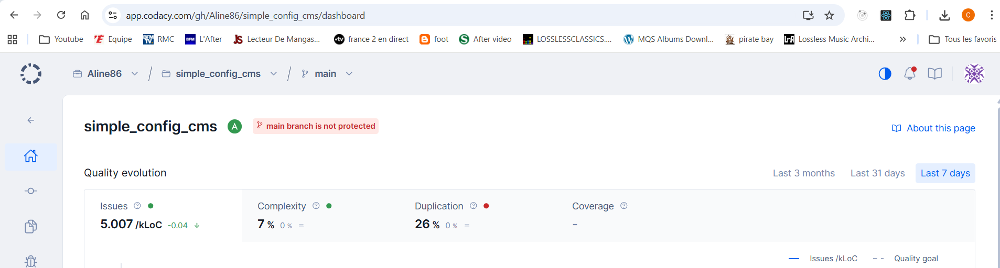

# Configurable Next.js Site (CMS)

## Overview

This project is a **configurable website built with Next.js**, where pages are entirely driven by configuration stored in a database (Prisma + PostgreSQL).  
Each block is defined by a `type` (component family) and a `bloc_name` (sub-type / variant).

Blocks are automatically sorted and rendered based on a `position` field updated during CRUD operations.  
Database queries retrieve blocks ordered by `bloc_page_position` ascending, enabling rendering **without complex business logic or scattered conditional statements**.

The architecture is **data-driven, maintainable, and extensible**, and includes:

- **Enums** to secure block types
- A **robust validation system** based on `BaseValidator` and field prefixes, enabling modular and reusable validation
- **Typed prefixes** (`text_`, `number_`, `checkbox_`, `image_`, `color_`) used to:
  - automatically determine which validation rules to apply
  - generate the appropriate editing component (text input, number input, checkbox, color picker, image upload)
  - ensure consistency between validation logic and the user interface
- **Centralized error handling** for consistent user feedback

---

## Architecture Type

**Data-driven monolith (frontend and backend within the same project)**

### Justification

- **Integrated frontend and backend**  
  Next.js handles both React rendering and database access via Prisma.

- **Monolithic yet modular**  
  Each block is isolated, testable, and extensible, while remaining within a single project.

- **No microservices**  
  Unnecessary here, as business logic is minimal and the rendering engine is self-sufficient.

- **Data-driven architecture**  
  Rendering is driven by database configuration, allowing layout and content changes without modifying code.

- **Modular validation**  
  A prefix-based validator system enables consistent validation of any data structure.

- **Maintainable and scalable**  
  Clear separation into components, hooks, libraries, utilities, and validators helps manage complexity.

---

## Technical Stack

- **Main framework**: Next.js 15+ (App Router, React Server Components)
- **Database**: PostgreSQL (Neon)
- **ORM**: Prisma
- **Validation**: Custom validation system using `BaseValidator` and prefixes
- **Component architecture**:
  - Each block has a `type` and a `name`
  - Components are rendered automatically based on database-defined order
  - Mapping `model.type.bloc_name → component` via a **registry**
- **Enums**: Used to secure block types and improve autocompletion
- **TypeScript**: Strict typing for code safety

---

## General Principle

- **Data-driven project**: everything is controlled by configuration
- **No complex business logic**: blocks are rendered as-is
- **Declarative validation**: validation rules are defined modularly using prefixes
- Rendering decisions depend solely on data retrieved from the database
- The frontend acts as a **pure rendering engine**
- Validators ensure data integrity before persistence

---

## Database UML Diagram

The database schema illustrates the relationships between the main system entities:


### Main Entities

#### **Page**

- Central entity representing a website page
- Contains metadata (title, slug, publication status, mode)
- Relationships: can have multiple `Header`, `Footer`, and `Bloc` entries

#### **Bloc**

- Represents a configurable content block
- Key properties:
  - `text_nom_bloc`: unique block type identifier (`TypeBloc` enum)
  - `text_titre`: block title
  - `text_type`: block variant
  - `number_bloc_position`: display order
  - `checkbox_is_full_width`: full-width display flag
  - `text_langue_bloc`: content language
- Relationships:
  - Belongs to a `Page`
  - Can contain multiple `Media` and `Article` entities

#### **Header and Footer**

- Reusable layout components
- Contain their own media (logos, images)
- Related to a `Page`

#### **Media**

- Media asset management (images, videos)
- Properties:
  - `text_titre`: media title
  - `text_image_lien`: URL or path
  - `number_position_image`: display order
- Relationships: can belong to a `Bloc`, `Header`, `Footer`, or `Article`

#### **Article**

- Structured textual content
- Properties:
  - `text_article`: article content
  - `number_width` and `number_height`: dimensions
  - `number_position_article`: display order
- Relationships:
  - Belongs to a `Bloc`
  - Can contain multiple `Media` entries

#### **TypeBloc (Enum)**

- Available block types:
  - `CAROUSEL`
  - `IMAGE_GROUPE`
  - `TEXTE`
  - `SCREEN`
  - `VIDEO`
  - `BOUTON`

#### **BaseValidator**

- Abstract class for data validation
- Main method: `validateAll()` with prefix support
- All entities are validated before database persistence

---

## Project Structure


## Data Flow

```
┌─────────────────┐
│   Database      │
│   (Prisma)      │
└────────┬────────┘
         │
         │ SELECT * FROM blocks ORDER BY bloc_page_position
         │
         ▼
┌─────────────────┐
│ Server Action   │
│ or API Route    │
└────────┬────────┘
         │
         │ Data retrieved via Prisma from Neon
         │
         ▼
┌─────────────────┐
│ Page Component  │
│   (SSR)         │
└────────┬────────┘
         │
         │ map(renderBlock)
         │
         ▼
┌─────────────────┐
│ Block Registry  │
│ type + name     │
└────────┬────────┘
         │
         │ Mapping to component
         │
         ▼
┌─────────────────┐
│ React Component │
│ (Hero, Gallery) │
└─────────────────┘
```

## Code Quality & Metrics

### Code quality metrics are monitored using Codacy and CodeScene, to evaluate maintainability, complexity, and overall code health.

- # Codacy Overview



Issues: 5.007 / kLoC

Complexity: 7% (low)

Duplication: 26%
Mainly due to repetitive data-driven component patterns and block variants

Coverage: not measured

- # CodeScene Health


Overall Code Health: 9.84 / 10 – Healthy

Majority of files classified as healthy

Very few risky or problematic areas

Overall Assessment

Readable and maintainable codebase

Low complexity

Cohesive and well-structured architecture

Duplication to monitor (acceptable for a configurable CMS)

Automated tests to be added to improve coverage

## Conclusion

The metrics confirm that the project is built on a solid and healthy foundation, with a robust and scalable data-driven architecture.

Future priorities mainly include:

reducing duplication across certain blocks

progressively introducing automated tests
