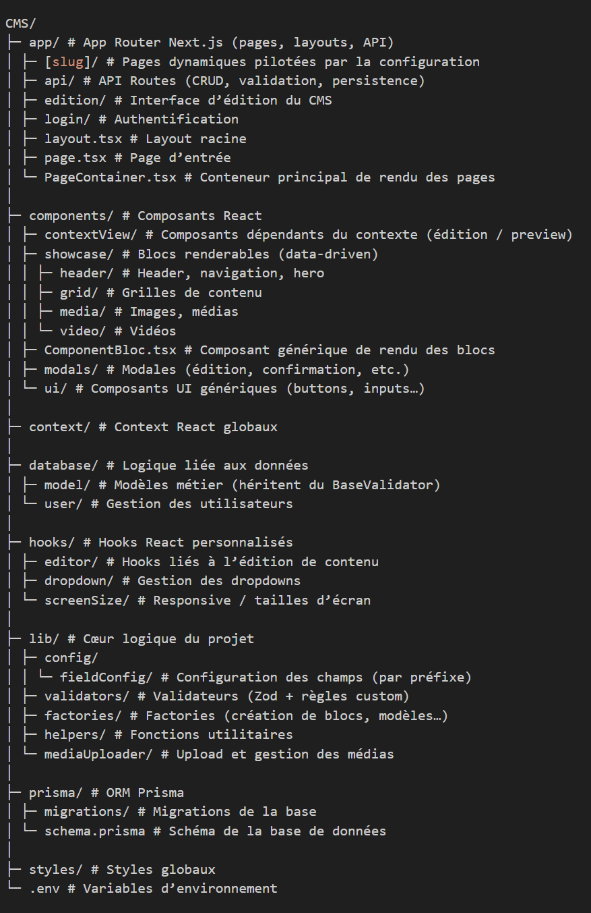
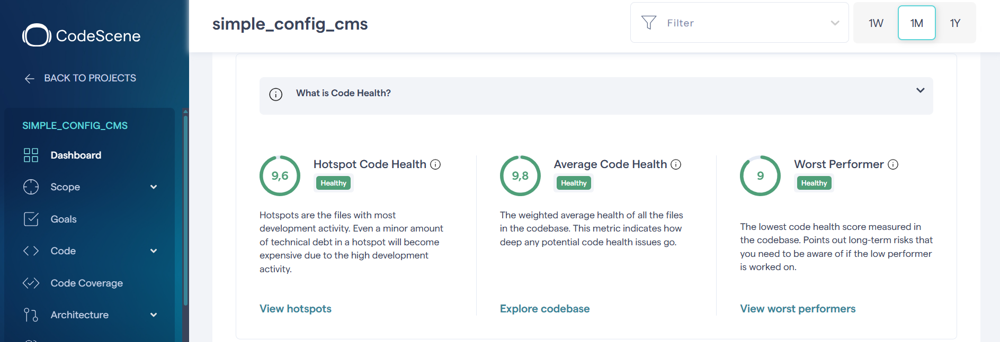
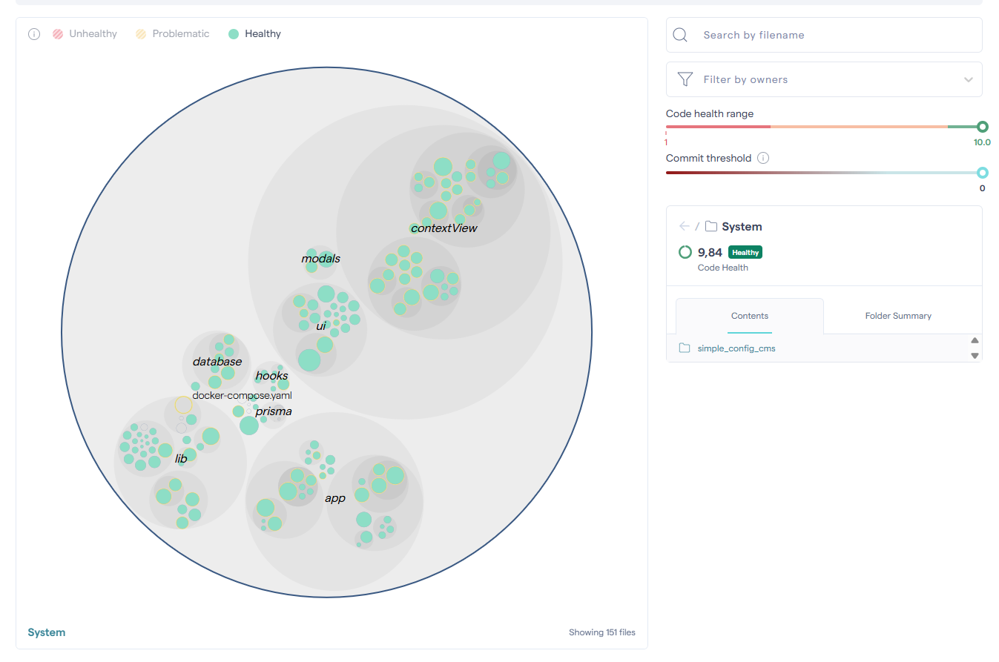
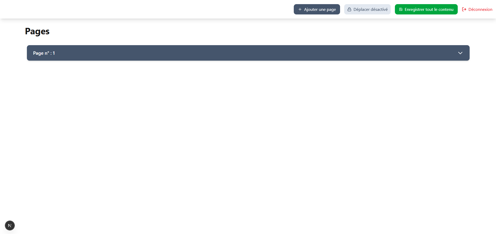
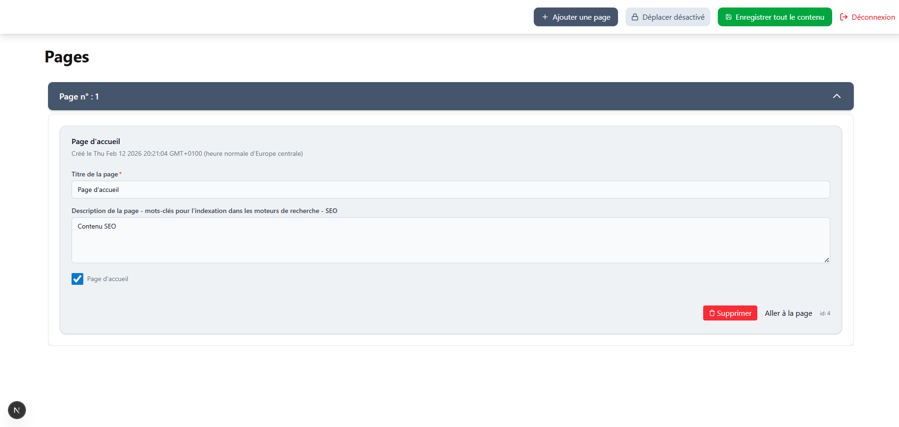
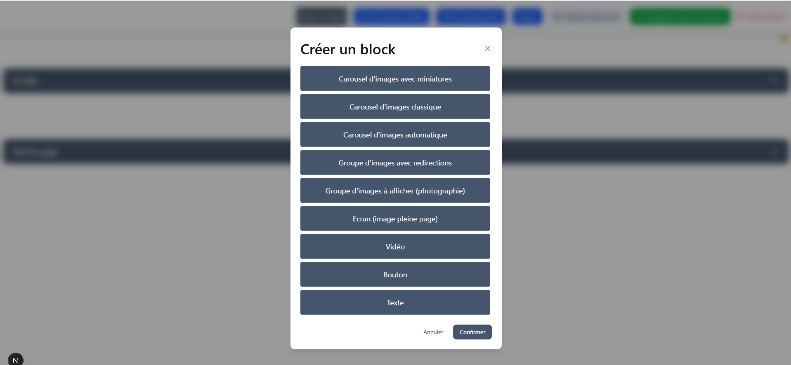
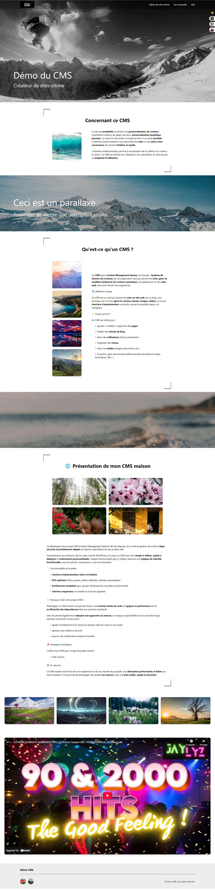

[ Français](README.md) | [ English](README.en.md)

## Projet en Production Réelle

### Utilisateur : Association Welcome Poitiers

Ce CMS est utilisé en production par l'association **Welcome Poitiers** depuis **janvier 2025**.

**Timeline du projet :**

- **Janvier 2025** : Mise en production V1 (architecture initiale)
- **Janvier 2025 - Février 2026** : Retours utilisateurs, corrections, optimisations
- **Février 2026** : Déploiement V2 (refonte complète avec ux optimisée)

### Évolution V1 → V2

**V1 (production depuis 1 an)** :

- Architecture fonctionnelle mais limitations identifiées
- Workflow d'édition moins fluide

**V2 (déploiement imminent)** :

- Refonte architecture avec Immer + path-based updates
- Preview synchronisé temps réel
- Amélioration UX significative (retours utilisateurs intégrés)
- Score qualité : 9.84/10 (vs ~7/10 en V1)

### Retours d'expérience

**Problématiques rencontrées en V1** :

- Gestion des médias (performances au niveau de l'affichage, les médias n'étaient pas optimisés)
- Validation des données (erreurs tardives)
- UX peu intuitive

**Solutions apportées en V2** :

- Migration vers Cloudinary (optimisation auto, possibilité de choisir des médias via le drive, ordinateur etc... grâce au picker de Cloudinary)
- Validation temps réel avec BaseValidator
- Drag & drop fluide avec recalcul positions
- ux modernisée, réactivité à tous les niveaux

**Impact mesuré** :

- Temps de création de page : -60% (30min → 12min)
- Erreurs de saisie : -75% (validation instantanée)
- Satisfaction utilisateur : forte amélioration (feedback qualitatif)

### Cas d'usage réel

L'association utilise le CMS pour :

- Pages événements
- Galeries photos (activités associatives)
- Pages d'information (démarches administratives)

**Volume** : ~15 pages actives, ~60 blocs, ~50 médias

# Site Configurable Next.js (CMS) avec preview en temps réel

[](https://app.codacy.com/gh/Aline86/simple_config_cms/dashboard?utm_source=gh&utm_medium=referral&utm_content=&utm_campaign=Badge_grade)

Ci-dessus : badge codacy (analyse statique du code) / La section métriques comprend une analyse dynamique du code avec l'outil Codescene.

## Résumé

Ce projet est un CMS configurable permettant une visualisation en direct, réalisé en Next.js. Il permet de créer facilement des sites vitrines dynamiques. Toutes les pages sont entièrement pilotées par le contenu stocké en base de données (Prisma + PostgreSQL). Chaque bloc est défini par un `type` (famille de composants) et un `bloc_name` (variante). Les composants sont triés et affichés automatiquement selon le champ position mis à jour lors des opérations de CRUD, les requêtes en base récupèrent les blocs ordonnés selon ce critère 'bloc_page_position' asc.

## Démo en images des possibilités offertes par le CMS


## Objectif métier

L’objectif est de permettre à des utilisateurs non techniques de modifier facilement le contenu et la structure des pages via une interface modulaire, sans écrire de code. Le CMS génère automatiquement l’interface utilisateur et valide les données, garantissant la cohérence entre configuration et rendu.

## Système de Preview en Temps Réel

Le CMS intègre un **système de prévisualisation synchronisée** permettant de voir
instantanément le rendu des modifications sans sauvegarder en base.

### Architecture technique

```
┌─────────────────────────────────────────────────────────┐
│                    Interface d'édition                   │
│  ┌─────────────────┐              ┌──────────────────┐  │
│  │   Form Editor   │────onChange──│  Preview Panel   │  │
│  │  (inputs, drag) │              │  (render live)   │  │
│  └────────┬────────┘              └──────────────────┘  │
│           │                                              │
│           │ updateByPath(path, value)                    │
│           ▼                                              │
│  ┌──────────────────────────────────────────────────┐   │
│  │         État centralisé (Immer + Context)        │   │
│  │  - Page complète en mémoire                      │   │
│  │  - Mise à jour immutable par chemin              │   │
│  │  - Synchronisation bidirectionnelle              │   │
│  └──────────────────────────────────────────────────┘   │
└─────────────────────────────────────────────────────────┘
```

### Fonctionnement

1. **Modification** : L'utilisateur édite un champ (ex: titre d'un bloc)
2. **Path resolution** : Le système identifie le chemin (`blocs.0.text_titre`)
3. **Update immutable** : Immer produit un nouvel état sans mutation
4. **Re-render** : Le preview se met à jour instantanément
5. **Validation** : Les erreurs s'affichent en temps réel
6. **Sauvegarde** : L'utilisateur décide quand persister en base

### Avantages

- **UX moderne** : WYSIWYG sans latence réseau
- **Validation instantanée** : Les erreurs sont visibles avant sauvegarde
- **Performances** : Pas de requête serveur à chaque modification
- **Rollback facile** : Annuler sans polluer la base de données

## Architecture globale

L'architecture est **data-driven, maintenable et extensible**, avec :

- **Enums** pour sécuriser les types de blocs
- **Système de validation robuste** avec `BaseValidator` et préfixes pour une validation modulaire et réutilisable
- Préfixes typés (text\_, number\_, checkbox\_, image\_, color\_) qui servent à :
  **Déterminer automatiquement le type de validation à appliquer,
  Générer le bon composant d'édition (input text, number, checkbox, color picker, upload d'image),
  Assurer la cohérence entre validation et interface utilisateur**
- **Gestion des erreurs centralisée** pour un retour utilisateur cohérent
- Les médias sont gérés via Cloudinary, permettant la gestion efficace de fichiers volumineux, l’optimisation automatique et la transformation à la volée, tout en gardant la base de données légère et le CMS rapide.

## Pattern Factory pour la création des blocs

Le système de création des blocs repose sur l’utilisation d’un \*_pattern Factory_ qui permet la création centralisée des blocs, ce qui rend cette fonctionnalité testable.

### Principe

- Chaque bloc est défini par :
  - un `type` représentant une famille de blocs ex: Carrousel
  - un `bloc_name` représentant une variante

### conséquence du principe précédent

- le couple `type + bloc_name` est utilisé comme clé de résolution des composants d'édition et visuels à afficher
- Le moteur de rendu n’a aucune connaissance des implémentations concrètes

## Mise à jour immutable par chemin dans l’arborescence des blocs et de la page plus globalement

La mise à jour de l’état repose sur un mécanisme **path-based**, permettant de modifier de manière ciblée n’importe quelle propriété au sein d’une structure de données imbriquée.

Ce mécanisme est implémenté via une fonction utilitaire générique utilisant **Immer**, garantissant une gestion stricte de l’immutabilité.

### Principe

- L’état est considéré comme une **arborescence de données**
- Chaque mise à jour est définie par :
  - un **chemin textuel** (`path`) utilisant la notation pointée (`a.b.c`)
  - une valeur cible
- Le chemin est résolu dynamiquement pour atteindre la propriété à modifier
- La mise à jour est produite sans mutation directe de l’objet source

### Fonctionnement

- Le chemin est découpé en clés successives
- L’arborescence est parcourue jusqu’à la clé finale
- Les nœuds intermédiaires sont créés si nécessaire
- La valeur est remplacée uniquement si elle diffère de l’existante
- Immer génère une **nouvelle version cohérente de l’état**

### Bénéfices architecturaux

- Mise à jour ciblée et prévisible
- Support des structures profondément imbriquées
- Immutabilité garantie sans complexité syntaxique
- Réduction des effets de bord
- Alignement avec l’architecture data-driven du CMS

Ce mécanisme est utilisé notamment pour la gestion des blocs, médias, headers et footers lors des opérations d’édition (CRUD, drag & drop, réorganisation).

## Type d'architecture

**Monolithique (frontend + backend dans le même projet)**

### Justification

- **Frontend et backend intégrés** : Next.js gère à la fois le rendu React et l'accès à la base via Prisma
- **Monolithique mais modulable** : chaque bloc est isolé, testable et extensible, mais tout est contenu dans un seul projet
- **Pas de microservices** : inutile ici, car la logique métier est quasi inexistante et le moteur de rendu est auto-suffisant
- **Validation modulaire** : système de validateurs avec préfixes permettant de valider n'importe quelle structure de données de manière cohérente
- **Maintenable et évolutif** : découpage en composants, hooks, lib, utils et validateurs pour gérer la complexité

---

## Analyse critique et défis rencontrées

Gestion des validations selon les types de champs avec BaseValidator et préfixes, nécessitant un système flexible mais complexe

Maintenir une cohérence forte entre configuration, validation et rendu UI

Solutions apportées

Utilisation d’un registry central pour mapper types → composants

Préfixes typés pour automatiser la validation et la génération des inputs d’édition

Contrôle strict avec TypeScript pour garantir la robustesse des données

Monitoring qualité avec Codacy et CodeScene, suivi de métriques de complexité et duplication

## Stack technique

- **Framework principal :** Next.js 15+ (App Router, React Server Components)
- **Base de données :** PostgreSQL (Neon)
- **ORM :** Prisma
- **Validation :** Système custom avec `BaseValidator` et préfixes
- **Architecture des composants :**
  - Chaque bloc a un `type` et un `name`
  - Les composants sont rendus automatiquement selon l'ordre défini en BDD
  - Mapping `model.type.bloc_name → composant` via un **registry**
- **Enums :** utilisés pour sécuriser les types de blocs et faciliter l'autocomplétion
- **TypeScript :** typage strict pour la sécurité du code

---

## Principe général

- **Absence de logique métier complexe** : les blocs sont affichés tels quels
- **Validation déclarative** : les règles de validation sont définies de manière modulaire avec préfixes
- Les décisions de rendu dépendent uniquement des données provenant de la base
- Le frontend agit comme un **moteur de rendu pur**
- Les validateurs assurent l'intégrité des données avant persistance

---

## Diagramme UML de la base de données

Le schéma de base de données illustre les relations entre les différentes entités du système :


### Entités principales

#### **Page**

- Entité centrale représentant une page du site
- Contient les métadonnées (titre, slug, publication, mode)
- Relations : peut avoir plusieurs `Header`, `Footer` et `Bloc`

#### **Bloc**

- Représente un bloc de contenu configurable
- Propriétés clés :
  - `text_nom_bloc` : identifiant unique du type de bloc (TypeBloc enum)
  - `text_titre` : titre du bloc
  - `text_type` : sous-type ou variante du bloc
  - `number_bloc_position` : ordre d'affichage
  - `checkbox_is_full_width` : affichage pleine largeur
  - `text_langue_bloc` : langue du contenu
- Relations :
  - Appartient à une `Page`
  - Peut contenir plusieurs `Media` et `Article`

#### **Header et Footer**

- Composants de layout réutilisables
- Contiennent leurs propres médias (logos, images)
- Relations : liés à une `Page`

#### **Media**

- Gestion des ressources média (images, vidéos)
- Propriétés :
  - `text_titre` : titre du média
  - `text_image_lien` : URL ou chemin
  - `number_position_image` : ordre d'affichage
- Relations : peut appartenir à un `Bloc`, `Header`, `Footer` ou `Article`

#### **Article**

- Contenu textuel structuré
- Propriétés :
  - `text_article` : contenu de l'article
  - `number_width` et `number_height` : dimensions
  - `number_position_article` : ordre d'affichage
- Relations :
  - Appartient à un `Bloc`
  - Peut contenir plusieurs `Media` (images intégrées)

#### **TypeBloc (Enum)**

- Énumération des types de blocs disponibles :
  - `CAROUSEL`
  - `IMAGE_GROUPE`
  - `TEXTE`
  - `SCREEN`
  - `VIDEO`
  - `BOUTON`

#### **BaseValidator**

- Classe abstraite pour la validation des données
- Méthode principale : `validateAll()` avec support des préfixes
- Toutes les entités passent par la validation avant persistance

## Structure des dossiers



## Système de validation avec BaseValidator

Le projet repose sur un système de validation modulaire et réutilisable, basé sur une classe BaseValidator dont héritent l’ensemble des modèles.
Cette classe permet de valider n’importe quelle structure de données, de manière centralisée et cohérente.

Chaque champ est automatiquement associé à un validateur dédié grâce à son préfixe ainsi qu’à une configuration spécifique grâce à son intitulé, permettant d’appliquer une validation Zod adaptée aux critères définis au moment de la validation.

### Avantages du système de validation

1. **Réutilisabilité** : `BaseValidator` peut être étendu pour valider n'importe quelle structure
2. **Préfixes** : validation de structures imbriquées avec identification précise des erreurs
3. **Typage fort** : TypeScript assure la cohérence des types validés
4. **Testabilité** : chaque validateur peut être testé indépendamment
5. **Maintenabilité** : les règles de validation sont centralisées et documentées
6. **Extensibilité** : ajouter de nouveaux validateurs est simple et suit le même pattern

---

## Flux de données

```
┌─────────────────┐
│  Base de données│
│    (Prisma)     │
└────────┬────────┘
         │
         │ SELECT * FROM blocks ORDER BY order
         │
         ▼
┌─────────────────┐
│  Server Action  │
│  ou API Route   │
│
└────────┬────────┘
         │
         │ Données récupérées via Prisma dans Néon
         │
         ▼
┌─────────────────┐
│  Page Component │
│   (SSR)  │
└────────┬────────┘
         │
         │ map(renderBlock)
         │
         ▼
┌─────────────────┐
│  Block Registry │
│  type + name    │
└────────┬────────┘
         │
         │ Mapping vers composant
         │
         ▼
┌─────────────────┐
│  React Component│
│  (Hero, Gallery)│
└─────────────────┘
```

## Qualité du code & métriques

Les métriques de qualité sont suivies via **Codacy** et **CodeScene**, afin d’évaluer la maintenabilité, la complexité et la santé globale du codebase.

---





- **Code Health global** : **9.84 / 10 – Healthy**
- Tous les fichiers sont classés comme **Healthy**
- Aucune zone à risque

#### Observations principales

- Les dossiers **lib**, **hooks**, **database** et **app** présentent une excellente santé
- Les composants UI et blocs sont bien regroupés, avec un couplage limité
- L’architecture data-driven limite la dette technique malgré la taille croissante du projet

---

### Lecture globale

- Code **lisible et maintenable**
- Faible complexité
- Architecture cohérente et bien découpée
- Duplication à surveiller (acceptable dans un CMS configurable)
- Tests automatisés à ajouter pour améliorer la couverture

---

### Conclusion

Les métriques confirment que le projet repose sur une **base saine**, avec une architecture robuste et évolutive.
La priorité future concerne principalement :

- la réduction de la duplication sur certains blocs
- l’introduction progressive de tests automatisés

## Installation et démarrage

### Prérequis

- Docker
- ou env local nodejs 20+ ainsi que postgresql ou neon

### Installation

```bash
# Cloner le projet
git clone https://github.com/Aline86/simple_config_cms.git
cd simple_config_cms

# Pour visualiser le projet vous pouvez utiliser un environnement **docker** de développement

# Configurer les variables d'environnement
créer un fichier .env à la racine du projet et y ajouter les variables suivantes pour visualiser le projet dans un environnement de développement :
- créer un compte sur Cloudinary et ajouter un upload preset de type unsigned puis récupérer les variables cloudname, api_key et api_secret dans la section api key et enfin ajouter un nom de dossier à côté de NEXT_PUBLIC_CLOUDINARY_UPLOAD_FOLDER

NEXT_PUBLIC_APP_URL:
NEXT_PUBLIC_CLOUDINARY_CLOUD_NAME:
CLOUDINARY_API_KEY:
CLOUDINARY_API_SECRET:
JWT_SECRET:
NEXT_PUBLIC_CLOUDINARY_UPLOAD_FOLDER:

une fois cette étape effectuée vous pouvez lancer les commandes :

- docker-compose build
- docker-compose up

la création des tables en base de données postgresql est automatisée ainsi que la création d'un user à l'aide d'un script de seed.

Vous pourrez accéder au bo à l'adresse http://localhost:3000/login grâce aux identifiants suivants :

- login: test@test.com
- mot de passe : test1234

Penser à cocher isHomePage sur l'une des page de l'édition à l'adresse http://localhost:3000/edition/pages pour que la racine du site expose un contenu.

### Développement

# Ouvrir Prisma Studio
npm prisma studio

# Lancer les tests
npm run test

---

## Tests

Des tests ont été prévus pour la création de blocs. Les tests sont gérés à l'aide de jest.
Vous pouvez les jouer à l'aide de la commande npm run tests.

Les tests sont présents dans le dossier tests.

---

## Support

Pour toute question ou problème :

- Ouvrir une issue sur GitHub
- Consulter la documentation dans `/docs`
- Me contacter

```

```

```

## Edition pages :





## Rendu final possible


