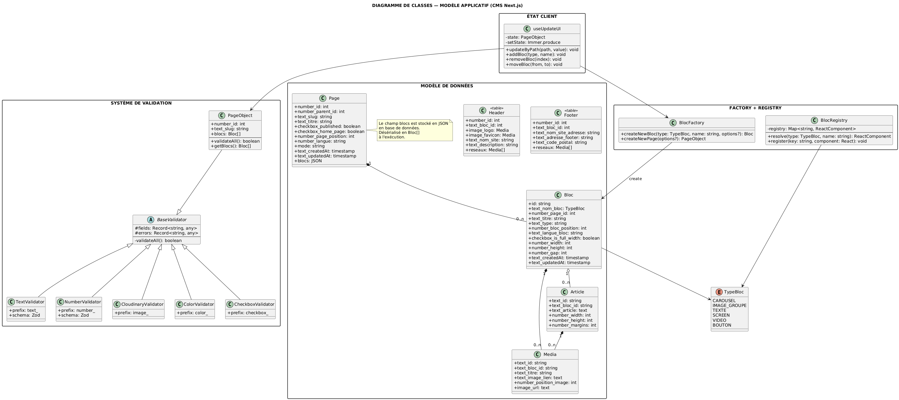
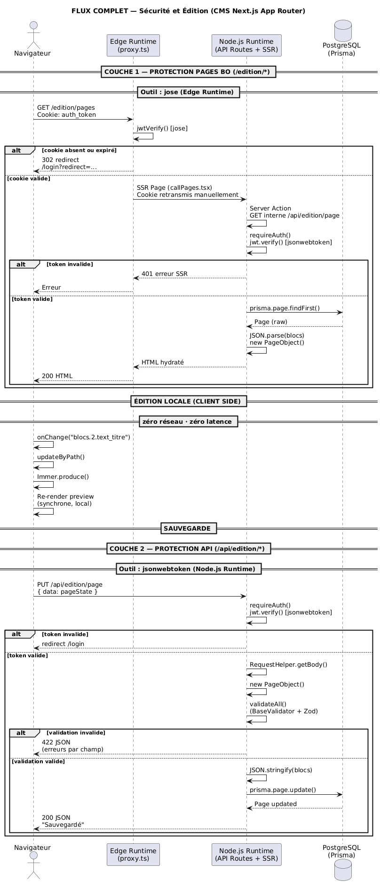

# Configurateur de sites vitrine

[](https://app.codacy.com/gh/Aline86/simple_config_cms/dashboard?utm_source=gh&utm_medium=referral&utm_content=&utm_campaign=Badge_grade)


[ Français](README.md) | [ English](README.en.md)

Configurateur de sites vitrine avec prévisualisation en temps réel, conçu en Next.js. Utilisé en production par l'**association Welcome Poitiers** depuis janvier 2025.

---

## Table des matières

- [Présentation](#présentation)
- [Fonctionnalités](#fonctionnalités)
- [Stack technique](#stack-technique)
- [Architecture](#architecture)
- [Installation](#installation)
- [Ajouter un bloc](#ajouter-un-bloc)
- [Système de validation](#système-de-validation)
- [Qualité du code](#qualité-du-code)
- [Tests](#tests)
- [Support](#support)

---

## Présentation

Simple Config Showcase est un moteur déclaratif configurable reposant sur un **système de résolution dynamique typé** (basé sur des préfixes sémantiques), intégrant un mécanisme de mise à jour immutable d'arbre par chemins et un système de validation modulaire générique.

Il permet à des utilisateurs non techniques de créer et modifier facilement des sites vitrines via une interface modulaire, sans écrire de code.

## Lien du site de démo :

<a href="https://simple-config-cms.vercel.app" target="_blank">Voir le site de démo en ligne en cliquant sur ce lien : click-me.</a>

## Vidéo de présentation du fonctionnement du BO / FO

[](Gif_presentation)

### Historique

| Période               | Événement                                        |
| --------------------- | ------------------------------------------------ |
| Janvier 2025          | Mise en production V1                            |
| Jan. 2025 – Fév. 2026 | Retours utilisateurs, corrections, optimisations |
| Février 2026          | Déploiement V2 — refonte complète, UX optimisée  |

---

## Fonctionnalités

- Prévisualisation synchronisée en temps réel (WYSIWYG sans latence réseau)
- Système de blocs modulaire et extensible
- Validation instantanée des données avant sauvegarde
- Drag & drop avec recalcul automatique des positions
- Gestion des médias via Cloudinary (optimisation auto, picker intégré)
- Architecture data-driven pilotée entièrement par la base de données

---

## Stack technique

| Couche          | Technologie                   |
| --------------- | ----------------------------- |
| Framework       | Next.js 15+ (App Router, RSC) |
| Langage         | TypeScript                    |
| Base de données | PostgreSQL (Neon)             |
| ORM             | Prisma                        |
| Médias          | Cloudinary                    |
| État            | Immer + Context API           |
| Tests           | Jest                          |
| Qualité         | Codacy, CodeScene             |

---

## Architecture

### Vue d'ensemble - Diagramme UML et justifications des choix architecturaux



# Architecture du configurateur de sites vitrine — Décisions Structurantes

---

## Stockage JSON des blocs dans Page

Un configurateur avec prévisualisation temps réel nécessite un état complet en mémoire.

— lire et écrire la page entière en un seul appel est plus adapté que reconstruire l'état depuis plusieurs entités relationnelles

La modulation entre types de blocs est gérée par composition :

— Bloc + Article[] + Media[]

— pas par héritage, pas besoin de classes enfant

Ce choix est proportionné au domaine d'affichage :  
pas de logique métier complexe, pas de requête par champ individuel

Dette assumée :  
pas de recherche full-text sur les champs de blocs, pas de filtrage par champ individuel

Extensibilité contrainte côté applicatif :  
un type de bloc dont la structure dépasse la composition actuelle nécessite de faire évoluer les classes TypeScript, la Factory et le Registry

— pas une migration BDD

---

## Header et Footer en tables séparées

Structure fixe et connue à l'avance — même schéma pour toutes les pages.

Requêtés indépendamment des blocs, cycle de vie distinct de la page.

La distinction reflète une décision sur la nature des données :

— structurées fixes → tables relationnelles  
— hétérogènes variables → JSON

---

## Deux niveaux de représentation — BDD vs modèle applicatif

Bloc, Media, Article sont des classes TypeScript désérialisées depuis le JSON à l'exécution.

Ils n'ont pas de table BDD propre.

Le diagramme de classes représente le modèle applicatif en mémoire, pas le schéma BDD.

PageObject est la classe applicative qui encapsule la désérialisation et la validation.

— elle n'est pas une table.

---

## BaseValidator + préfixes typés

Convention text*, image*, number*, color*, checkbox\_ comme contrat entre configuration BDD, validation et rendu.

Le validateur et le composant d'édition sont déterminés automatiquement par le préfixe.

— aucun switch  
— aucune condition explicite

Réutilisable sur n'importe quelle entité qui étend BaseValidator.

---

## Pattern Factory pour la création des blocs

Création centralisée et testable — createNewBloc() avec options typées.

Le moteur de rendu n'a aucune connaissance des implémentations concrètes.

Ajouter un nouveau type de bloc ne modifie pas le moteur de rendu

— ouvert à l'extension  
— fermé à la modification

---

## État immutable avec Immer + updateByPath

Édition locale sans aucun appel réseau — re-render synchrone, zéro latence

Notation pointée blocs.2.text_titre pour cibler n'importe quelle propriété dans la hiérarchie imbriquée

L'utilisateur décide quand persister — rollback possible sans polluer la base

Immutabilité garantie sans complexité syntaxique

---

## Deux couches de sécurité JWT

Imposé par les deux environnements d'exécution distincts de Next.js App Router
jose en Edge Runtime

— jsonwebtoken indisponible en Edge car dépend des APIs Node.js

Le chargement initial passe par Edge Runtime puis SSR.

→ le GET /api/edition/page est fait côté serveur par la Server Action, pas par le navigateur

La sauvegarde PUT arrive directement du navigateur sur les API Routes hors matcher Edge.

Les deux flux n'empruntent pas les mêmes couches.

— les deux protections sont complémentaires et non redondantes

---

## Cookie retransmis manuellement

Les Server Actions peuvent lire les cookies via cookies(), mais un fetch interne vers une API Route ne les transmet pas automatiquement. Il est donc nécessaire de les extraire manuellement et de les réinjecter dans les headers du fetch pour que l'authentification soit transmise côté serveur.

---

## Architecture monolithique

Pas de logique métier complexe — moteur de rendu pur piloté par les données.

Microservices inutiles : coût d'infrastructure et de communication disproportionné au besoin réel.

Monolithique mais modulable :

— composants isolés  
— testables  
— extensibles par convention

### Diagramme de séquence de la sécurité



### Mise à jour immutable par chemin

Chaque modification est définie par un **chemin textuel** (`blocs.0.text_titre`) et une valeur cible. Immer produit un nouvel état sans mutation directe, garantissant immutabilité et prévisibilité.

### Pattern Factory

La création des blocs repose sur un pattern Factory centralisé, ce qui rend la fonctionnalité testable et découple le moteur de rendu des implémentations concrètes.

### Préfixes typés

Les champs sont préfixés de manière sémantique : `text_`, `number_`, `checkbox_`, `image_`, `color_`. Ces préfixes permettent de :

- déterminer automatiquement le type de validation à appliquer
- générer le bon composant d'édition (input text, number, checkbox, color picker, upload d'image)
- assurer la cohérence entre validation et interface utilisateur

---

## Installation

### Prérequis

- Docker **ou** Node.js 20+ avec PostgreSQL / Neon (production)

### Étapes

**1. Cloner le projet**

```bash
git clone https://github.com/Aline86/simple_config_cms.git
cd simple_config_cms
```

**2. Configurer les variables d'environnement**

Créer un fichier `.env` à la racine du projet :

```env
NEXT_PUBLIC_APP_URL=http://localhost:3000

JWT_SECRET=votre_chaine_aleatoire_secrete

# Récupérées depuis https://console.cloudinary.com
# (roue crantée → API Keys → Generate New Api Key)
NEXT_PUBLIC_CLOUDINARY_CLOUD_NAME=
CLOUDINARY_API_KEY=
CLOUDINARY_API_SECRET=
NEXT_PUBLIC_CLOUDINARY_UPLOAD_FOLDER=
```

> ⚠️ Pensez également à créer un **preset unsigned** sur Cloudinary pour que le picker d'images fonctionne.

**3. Lancer avec Docker**

```bash
docker compose build
docker compose up
```

La création des tables PostgreSQL et d'un utilisateur de test est automatisée via un script de seed.

**4. Se connecter**

Accédez au back-office sur [http://localhost:3000/login](http://localhost:3000/login) :

```
login    : test@test.com
password : test1234
```

> 💡 Pensez à cocher **Page d'accueil** sur l'une des pages dans l'édition (`/edition/pages`) pour que la racine du site affiche un contenu.

---

## Ajouter un bloc

L'ajout d'un nouveau type de bloc se fait en **4 étapes** :

**1. Déclarer le type dans l'enum**

```typescript
// database/model/Page.tsx
export enum TypeBloc {
  CAROUSEL = "CAROUSEL",
  // ... types existants
  MON_NOUVEAU_BLOC = "MON_NOUVEAU_BLOC",
}
```

**2. Créer ses options dans la modal de choix**

Dans `components/modals/PageChoiceModal.tsx`, définir les options du bloc et ajouter son bouton :

```tsx
<button
  aria-label="Créer un bloc Custom"
  className="px-4 py-4 rounded bg-slate-600 text-white text-lg hover:bg-slate-700 transition"
  onClick={() => addBlocToPage(options_mon_nouveau_bloc)}
>
  Mon nouveau bloc
</button>
```

**3. Créer les composants d'édition et de visualisation**

- Fichier d'édition : `components/contextView/edition/`
- Fichier de visualisation : `components/contextView/showcase/`

**4. Enregistrer le bloc dans le registry**

Dans `lib/config/componentsView.tsx` :

```typescript
blocksToRender: {
  // is_custom: false si le bloc suit le pattern d'affichage habituel
  // is_custom: true si le bloc possède un template d'édition spécifique
  MON_NOUVEAU_BLOC: {
    is_custom: false;
  }
}

blocksFrontToRender: {
  MON_NOUVEAU_BLOC: MonNouveauBlocShowcase;
}
```

---

## Système de validation

Le projet repose sur une classe abstraite `BaseValidator` dont héritent tous les modèles. Chaque champ est automatiquement associé à un validateur dédié grâce à son préfixe et à sa configuration, permettant d'appliquer une validation Zod adaptée.

Avantages : réutilisabilité, typage fort, testabilité indépendante, extensibilité simple.

---

## Qualité du code

Suivi via **Codacy** et **CodeScene** :

| Métrique           | Valeur        |
| ------------------ | ------------- |
| Code Health global | **9.84 / 10** |
| Statut             | ✅ Healthy    |
| Fichiers à risque  | Aucun         |

Axes d'amélioration identifiés :

- Réduction de la duplication sur certains blocs
- Introduction progressive de tests automatisés

---

## Tests

Des tests couvrent la création de blocs et la mise à jour par chemin dans la structure imbriquée.

```bash
# Lancer les tests
npm run test

# Vider le cache Jest avant de jouer les tests
npm test -- --clearCache
```

Les tests sont situés dans le dossier `__tests__/` et gérés avec **Jest**.

---

## Support

- Ouvrir une **[Issue sur GitHub](https://github.com/Aline86/simple_config_cms/issues)**
- Consulter la documentation dans `/docs`
- Consulter le guide de contribution dans [CONTRIBUTING.md](./Contributing.md)

---

## Licence

Ce projet est distribué sous licence **[Creative Commons Attribution-NonCommercial 4.0 International (CC BY-NC 4.0)](./License.md)**.  
Usage commercial interdit sans autorisation explicite.

## Visuel possible

[](visuel_rapide)
