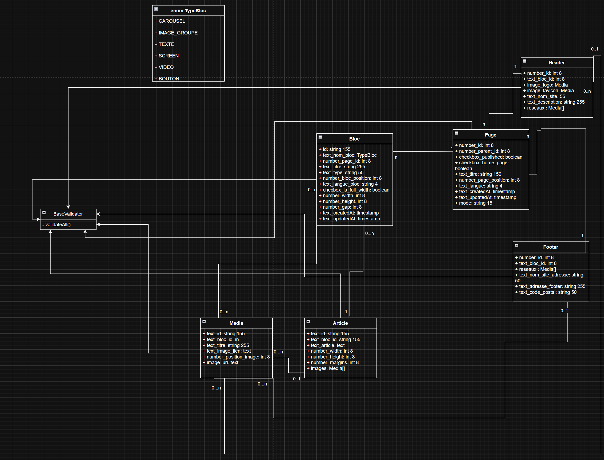

# Site Configurable Next.js avec Validation Data-Driven

## Résumé

Ce projet est un **site configurable effectué en Next.js**, où les pages sont entièrement pilotées par la configuration stockée en base de données (Prisma + PostgreSQL). Chaque bloc est défini par un `type` (famille de composants) et un `bloc_name` (sous-type / déclinaison). Les composants sont triés et affichés automatiquement selon le champ position mis à jour lors des opérations de CRUD, les requêtes en base récupèrent les blocs ordonnés selon ce critère 'bloc_page_position' asc, sans logique métier complexe ni conditions dispersées.

L'architecture est **data-driven, maintenable et extensible**, avec :

- **Enums** pour sécuriser les types de blocs
- **Système de validation robuste** avec `BaseValidator` et préfixes pour une validation modulaire et réutilisable
- Préfixes typés (text\_, number\_, checkbox\_, image\_, color\_) qui servent à :
  **Déterminer automatiquement le type de validation à appliquer,
  Générer le bon composant d'édition (input text, number, checkbox, color picker, upload d'image),
  Assurer la cohérence entre validation et interface utilisateur**
- **Gestion des erreurs centralisée** pour un retour utilisateur cohérent

---

## Type d'architecture

**Monolithique data-driven (frontend + backend dans le même projet)**

### Justification

- **Frontend et backend intégrés** : Next.js gère à la fois le rendu React et l'accès à la base via Prisma
- **Monolithique mais modulable** : chaque bloc est isolé, testable et extensible, mais tout est contenu dans un seul projet
- **Pas de microservices** : inutile ici, car la logique métier est quasi inexistante et le moteur de rendu est auto-suffisant
- **Data-driven** : l'architecture repose sur la configuration stockée en BDD, permettant de modifier le rendu sans toucher au code
- **Validation modulaire** : système de validateurs avec préfixes permettant de valider n'importe quelle structure de données de manière cohérente
- **Maintenable et évolutif** : découpage en composants, hooks, lib, utils et validateurs pour gérer la complexité

---

## Stack technique

- **Framework principal :** Next.js 15+ (App Router, React Server Components)
- **Base de données :** PostgreSQL (Neon)
- **ORM :** Prisma
- **Validation :** Système custom avec `BaseValidator` et préfixes
- **Architecture des composants :**
  - Chaque bloc a un `type` et un `name`
  - Les composants sont rendus automatiquement selon l'ordre défini en BDD
  - Mapping `model.type.bloc_name → composant` via un **registry**
- **Enums :** utilisés pour sécuriser les types de blocs et faciliter l'autocomplétion
- **TypeScript :** typage strict pour la sécurité du code

---

## Principe général

- Projet **data-driven** : tout est piloté par la configuration
- **Absence de logique métier complexe** : les blocs sont affichés tels quels
- **Validation déclarative** : les règles de validation sont définies de manière modulaire avec préfixes
- Les décisions de rendu dépendent uniquement des données provenant de la base
- Le frontend agit comme un **moteur de rendu pur**
- Les validateurs assurent l'intégrité des données avant persistance

---

## Diagramme UML de la base de données

Le schéma de base de données illustre les relations entre les différentes entités du système :



### Entités principales

#### **Page**

- Entité centrale représentant une page du site
- Contient les métadonnées (titre, slug, publication, mode)
- Relations : peut avoir plusieurs `Header`, `Footer` et `Bloc`

#### **Bloc**

- Représente un bloc de contenu configurable
- Propriétés clés :
  - `text_nom_bloc` : identifiant unique du type de bloc (TypeBloc enum)
  - `text_titre` : titre du bloc
  - `text_type` : sous-type ou variante du bloc
  - `number_bloc_position` : ordre d'affichage
  - `checkbox_is_full_width` : affichage pleine largeur
  - `text_langue_bloc` : langue du contenu
- Relations :
  - Appartient à une `Page`
  - Peut contenir plusieurs `Media` et `Article`

#### **Header et Footer**

- Composants de layout réutilisables
- Contiennent leurs propres médias (logos, images)
- Relations : liés à une `Page`

#### **Media**

- Gestion des ressources média (images, vidéos)
- Propriétés :
  - `text_titre` : titre du média
  - `text_image_lien` : URL ou chemin
  - `number_position_image` : ordre d'affichage
- Relations : peut appartenir à un `Bloc`, `Header`, `Footer` ou `Article`

#### **Article**

- Contenu textuel structuré
- Propriétés :
  - `text_article` : contenu de l'article
  - `number_width` et `number_height` : dimensions
  - `number_position_article` : ordre d'affichage
- Relations :
  - Appartient à un `Bloc`
  - Peut contenir plusieurs `Media` (images intégrées)

#### **TypeBloc (Enum)**

- Énumération des types de blocs disponibles :
  - `CAROUSEL`
  - `IMAGE_GROUPE`
  - `TEXTE`
  - `SCREEN`
  - `VIDEO`
  - `BOUTON`

#### **BaseValidator**

- Classe abstraite pour la validation des données
- Méthode principale : `validateAll()` avec support des préfixes
- Toutes les entités passent par la validation avant persistance

```

---

## Structure des dossiers

```

CMS/
├─ app/ # App Router Next.js (pages, layouts, API)
│ ├─ [slug]/ # Pages dynamiques pilotées par la configuration
│ ├─ api/ # API Routes (CRUD, validation, persistence)
│ ├─ edition/ # Interface d’édition du CMS
│ ├─ login/ # Authentification
│ ├─ layout.tsx # Layout racine
│ ├─ page.tsx # Page d’entrée
│ └─ PageContainer.tsx # Conteneur principal de rendu des pages
│
├─ components/ # Composants React
│ ├─ contextView/ # Composants dépendants du contexte (édition / preview)
│ ├─ showcase/ # Blocs renderables (data-driven)
│ │ ├─ header/ # Header, navigation, hero
│ │ ├─ grid/ # Grilles de contenu
│ │ ├─ media/ # Images, médias
│ │ └─ video/ # Vidéos
│ ├─ ComponentBloc.tsx # Composant générique de rendu des blocs
│ ├─ modals/ # Modales (édition, confirmation, etc.)
│ └─ ui/ # Composants UI génériques (buttons, inputs…)
│
├─ context/ # Context React globaux
│
├─ database/ # Logique liée aux données
│ ├─ model/ # Modèles métier (héritent du BaseValidator)
│ └─ user/ # Gestion des utilisateurs
│
├─ hooks/ # Hooks React personnalisés
│ ├─ editor/ # Hooks liés à l’édition de contenu
│ ├─ dropdown/ # Gestion des dropdowns
│ └─ screenSize/ # Responsive / tailles d’écran
│
├─ lib/ # Cœur logique du projet
│ ├─ config/
│ │ └─ fieldConfig/ # Configuration des champs (par préfixe)
│ ├─ validators/ # Validateurs (Zod + règles custom)
│ ├─ factories/ # Factories (création de blocs, modèles…)
│ ├─ helpers/ # Fonctions utilitaires
│ └─ mediaUploader/ # Upload et gestion des médias
│
├─ prisma/ # ORM Prisma
│ ├─ migrations/ # Migrations de la base
│ └─ schema.prisma # Schéma de la base de données
│
├─ styles/ # Styles globaux
└─ .env # Variables d’environnement

````

---

## Système de validation avec BaseValidator
Le projet repose sur un système de validation modulaire et réutilisable, basé sur une classe BaseValidator dont héritent l’ensemble des modèles.
Cette classe permet de valider n’importe quelle structure de données, de manière centralisée et cohérente.

Chaque champ est automatiquement associé à un validateur dédié grâce à son préfixe ainsi qu’à une configuration spécifique grâce à son intitulé, permettant d’appliquer une validation Zod adaptée aux critères définis au moment de la validation.


### Avantages du système de validation

1. **Réutilisabilité** : `BaseValidator` peut être étendu pour valider n'importe quelle structure
2. **Préfixes** : validation de structures imbriquées avec identification précise des erreurs
3. **Typage fort** : TypeScript assure la cohérence des types validés
4. **Testabilité** : chaque validateur peut être testé indépendamment
5. **Maintenabilité** : les règles de validation sont centralisées et documentées
6. **Extensibilité** : ajouter de nouveaux validateurs est simple et suit le même pattern

---

## Flux de données

```
┌─────────────────┐
│  Base de données│
│    (Prisma)     │
└────────┬────────┘
         │
         │ SELECT * FROM blocks ORDER BY order
         │
         ▼
┌─────────────────┐
│  Server Action  │
│  ou API Route   │
│
└────────┬────────┘
         │
         │ Données récupérées via Prisma dans Néon
         │
         ▼
┌─────────────────┐
│  Page Component │
│   (SSR)  │
└────────┬────────┘
         │
         │ map(renderBlock)
         │
         ▼
┌─────────────────┐
│  Block Registry │
│  type + name    │
└────────┬────────┘
         │
         │ Mapping vers composant
         │
         ▼
┌─────────────────┐
│  React Component│
│  (Hero, Gallery)│
└─────────────────┘
```

---

## Installation et démarrage

### Prérequis

- Node.js 18+
- PostgreSQL (ou compte Neon)
- pnpm, npm ou yarn

### Installation

```bash
# Cloner le projet
git clone <repository-url>
cd <project-name>

# Installer les dépendances
pnpm install

# Configurer les variables d'environnement
cp .env.example .env
# Éditer .env avec votre DATABASE_URL

# Générer le client Prisma
pnpm prisma generate

# Exécuter les migrations
pnpm prisma migrate dev

# (Optionnel) Seed de données de démonstration
pnpm prisma db seed
```

### Développement

```bash
# Lancer le serveur de développement
pnpm dev

# Ouvrir Prisma Studio
pnpm prisma studio

# Lancer les tests
pnpm test

# Build de production
pnpm build
```

---

## Tests


---

## Métrics

---

## Support

Pour toute question ou problème :

- Ouvrir une issue sur GitHub
- Consulter la documentation dans `/docs`
- Contacter l'équipe de développement
````
