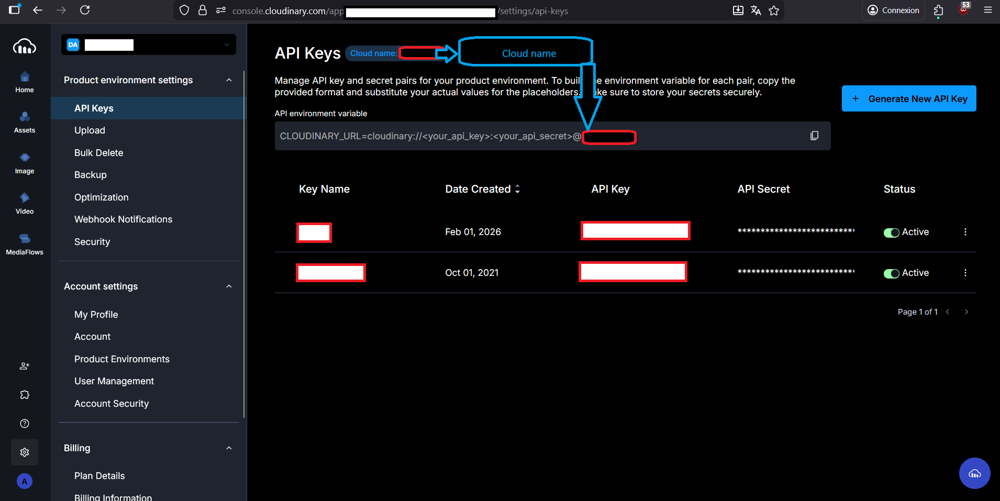
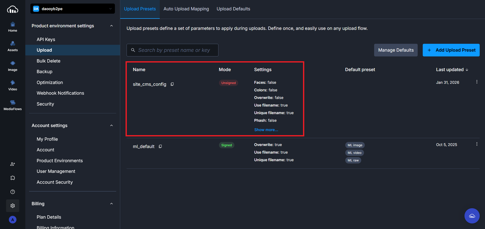
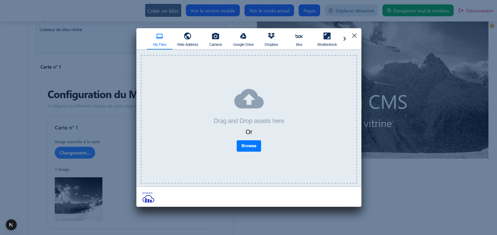

[ Français](README.md) | [ English](README.en.md)

# Comment déployer le CMS en production avec un plan de hosting gratuit (bdd et solution d'hébergement du code) ?

## Installation et démarrage

### Prérequis

- BDD neon pour la production (PostgreSQL) : `https://neon.com/` : Se rendre sur le site et créer un nouveau projet
- une environnement local avec nodeJS 20+

# Installation

### Cloner le projet

```
git clone https://github.com/Aline86/simple_config_cms.git
cd simple_config_cms
```

- avoir installer les dépendances du projet en local avec la commande suivante `npm install` dans le terminal, attendre 5 min que les dépendances chargent

## Configurer les variables d'environnement

créer un fichier .env à la racine du projet et y ajouter les variables suivantes pour visualiser le projet dans un environnement de développement :

````
Les variables d'environnement sont les suivantes :

NEXT_PUBLIC_APP_URL: url de votre app ( locale ou de production en fonction de l'environnement de montage )
JWT_SECRET: chaîne aléatoire que vous seul connaissez et que vous inventez

Les quatre variables cloudinary se récupèrent de la façon suivante:
- créer un compte sur cloudinary : https://console.cloudinary.com
- cliquer sur la base de donnée nouvellement créée, cliquer sur ``Dashboard``` puis Connect, vous aurez alors accès à votre url de connexion. Récupérez-là avec le mot de passe en clair et mettez l'url de connexion dans votre fichier .env à la racine en valeur de la variable DATABASE_URL.

NEXT_PUBLIC_CLOUDINARY_CLOUD_NAME=
CLOUDINARY_API_KEY=
CLOUDINARY_API_SECRET=
NEXT_PUBLIC_CLOUDINARY_UPLOAD_FOLDER=
DATABASE_URL=
````

Pour récupérer les quatre valeurs des variables suivantes, suivre les indications suivantes :
NEXT_PUBLIC_CLOUDINARY_CLOUD_NAME=
CLOUDINARY_API_KEY=
CLOUDINARY_API_SECRET=
NEXT_PUBLIC_CLOUDINARY_UPLOAD_FOLDER=



(roue crantée, API Keys puis Generate New Api Key)

Il vous faudra ensuite créer un preset (unsigned):



Ces actions vous permettent de faire fonctionner le picker de Cloudinary utilisé dans l'app pour le chargement d'images sur votre cloud Cloudinary nouvellement créé :



- une fois cette étape effectuée vous devrez lancer les commandes prisma depuis votre environnement local pour créer le shéma de votre base de données en ligne Neon :

  `npx prisma init`
  `npx prisma generate`
  `npx prisma migrate dev --name init`

- Je n'ai pas fait de script de seed pour créer un user en db en prod pour des raisons de sécurité.
- créer un fichier hash.js à la racine du projet, y placer le code suivant :

```
import bcrypt from 'bcrypt';

const password = process.argv[2]; // mot de passe passé en argument
const saltRounds = 10;

bcrypt.hash(password, saltRounds, function(err, hash) {
  if (err) throw err;
  console.log(hash);
});
```

- Lancer la commande suivante dans le terminal en remplaçant le mot de passe par votre mot de passe
  `node hash.js monMotDePasse123`
- recopier la sortie et la placer dans le champ motDePasse de l'entité User en bdd de neon (cliquer sur tables à gauche puis l'entité User sur le site qui stocke votre base de données neon)
  Remplir tous les autres champs de la ligne avec vos identifiants et données personnelles associées au site à déployer.
- une fois ces actions effectuées supprimer le fichier hash.js

- Il vous faudra maintenant push le projet sur votre environnement github pour pouvoir le lier à netlify `https://app.netlify.com`
  Sur votre dashboard cliquer sur `Add new project` puis `Import an existing project` puis `Github` puis sélectionner votre projet nouvellement push. Ajouter toutes les variables d'environnement du .env et dans le champ Build Command ajouter `npx prisma generate --schema=prisma/schema.prisma && next build` . Laisser les autres variables par défaut -- ne rien modifier d'autre.

- Par la suite si vous devez changer ces variables, elles seront accessibles via les actions suivantes : Cliquer sur `Project Configuration` puis cliquer sur `Environnment Variables`.

- Une fois ces actions effectuées cliquer sur Deploys à gauche pluis `Trigger deploy` à gauche.
